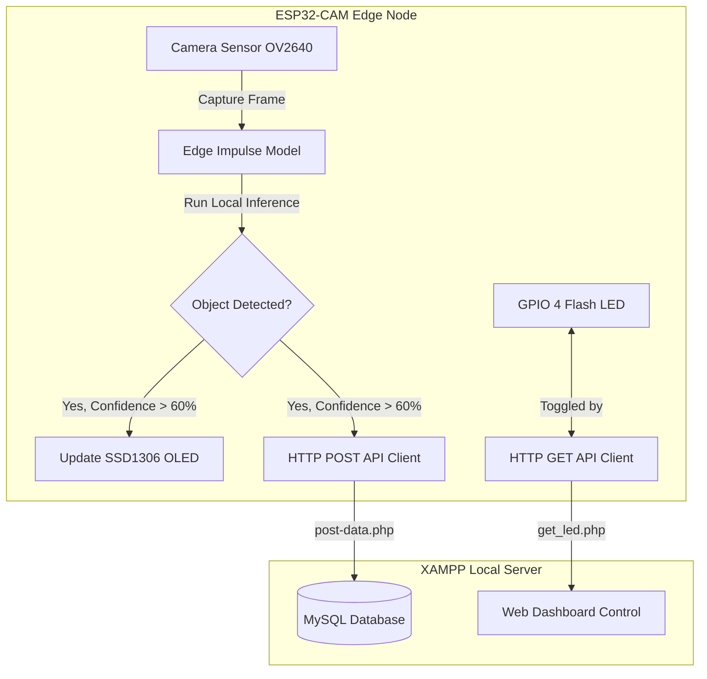

# 🍎 ESP32-CAM IoT Fruit Detection & Logging System

[](https://www.arduino.cc/)
[](https://edgeimpulse.com/)
[](https://www.mysql.com/)
[](https://www.php.net/)

An Internet-of-Things (IoT) fruit detection system that performs real-time **TinyML Object Detection** locally on an ESP32-CAM. When fruits are detected with high confidence, the system displays the name on an SSD1306 OLED screen, toggles a web-controlled LED flash, and logs the bounding box coordinates to a MySQL database via a PHP REST API.

---

## 📐 System Architecture



---

## ✨ Features

* **🧠 Embedded Object Detection**: Runs an Edge Impulse TinyML model locally on the ESP32-CAM.
* **📺 Real-time OLED Feedback**: Displays labels and classification confidence percentages on an SSD1306 OLED screen (I2C interface).
* **💡 Web-Controlled Flash**: Checks the flash light status from the server (`get_led.php`) and toggles the GPIO 4 Flash LED prior to capturing images.
* **💾 REST API Logging**: Automatically transmits fruit labels, confidence scores, and bounding box coordinates (`x`, `y`, `width`, `height`) via HTTP POST parameters to `post-data.php`.
* **🗄️ Relational Database Storage**: Persists inference data into a MySQL database.

---

## 📁 Repository Structure

* **`espcam with oled`**: The primary Arduino code that runs on the ESP32-CAM. Connects to WiFi, controls the OLED, executes classification, and handles HTTP API communication.
* **`Address scan for LCD OLED`**: A helper Arduino sketch used to scan and verify the I2C address of your SSD1306 OLED screen.
* **`inference.sql`**: The database schema script to create the `inference` logging table.
* **`[doesnt work] coap_server.py`**: A deprecated Python script trying to use the CoAP protocol. (Superseded by XAMPP PHP/MySQL REST API).
* **`notes`**: Brief info on required libraries.

---

## 🛠️ Hardware Setup

### Connections
The SSD1306 OLED screen communicates via I2C. Because the ESP32-CAM does not have dedicated standard I2C pins exposed, custom software I2C pins are defined:
* **OLED SDA** ➡️ **GPIO 15**
* **OLED SCL** ➡️ **GPIO 14**
* **OLED VCC** ➡️ **3.3V / 5V**
* **OLED GND** ➡️ **GND**

---

## 💻 Software & Server Setup

### 1. Database Setup (MySQL/XAMPP)
1. Start XAMPP Control Panel and enable **Apache** and **MySQL**.
2. Go to **phpMyAdmin** (`http://localhost/phpmyadmin`).
3. Create a database named `fruit_detection`.
4. Import the table schema using the [inference.sql](file:///C:/Tools/iot_project-fruit_detection/inference.sql) file.

### 2. PHP Backend APIs
Deploy the following PHP scripts in your local XAMPP `htdocs/esp32_api/` directory:

#### `post-data.php`
Saves incoming HTTP POST data from the ESP32-CAM into the database:
```php
<?php
$servername = "localhost";
$username = "root";
$password = "";
$dbname = "fruit_detection";

if ($_SERVER["REQUEST_METHOD"] == "POST") {
    $conn = new mysqli($servername, $username, $password, $dbname);
    if ($conn->connect_error) { die("Connection failed: " . $conn->connect_error); }

    $label = $_POST["label"];
    $value = $_POST["value"];
    $x = $_POST["x"];
    $y = $_POST["y"];
    $width = $_POST["width"];
    $height = $_POST["height"];

    $sql = "INSERT INTO inference (Label, VALUE, X, Y, width, height) 
            VALUES ('$label', '$value', '$x', '$y', '$width', '$height')";

    if ($conn->query($sql) === TRUE) {
        echo "ok";
    } else {
        echo "Error: " . $sql . "<br>" . $conn->error;
    }
    $conn->close();
}
?>
```

#### `get_led.php`
Returns either `"1"` or `"0"` to tell the ESP32-CAM whether to toggle the Flash LED:
```php
<?php
// Retrieve and output the LED state from your dashboard interface (1 for ON, 0 for OFF)
echo "0"; 
?>
```

### 3. Arduino Configuration
1. Open [espcam with oled](file:///C:/Tools/iot_project-fruit_detection/espcam%20with%20oled) in the Arduino IDE.
2. Install the required libraries in Arduino Library Manager:
   * **Adafruit SSD1306**
   * **Adafruit GFX Library**
3. Import your exported **Edge Impulse C++ library** `.zip` file via *Sketch > Include Library > Add .ZIP Library...*. Make sure it matches `#include <IoT-FruitDetection-Project_inferencing.h>`.
4. Modify the WiFi credentials and server IP addresses at the top of the file:
   ```cpp
   const char* ssid = "YOUR_WIFI_SSID";
   const char* password = "YOUR_WIFI_PASSWORD";
   String serverName = "http://YOUR_SERVER_IP/esp32_api/post-data.php";
   String serverLed = "http://YOUR_SERVER_IP/esp32_api/get_led.php";
   ```
5. Select **AI Thinker ESP32-CAM** as the board and upload the sketch.